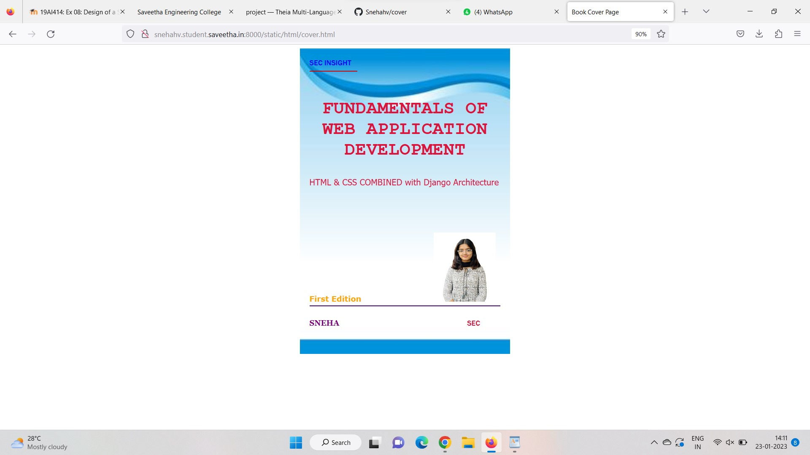
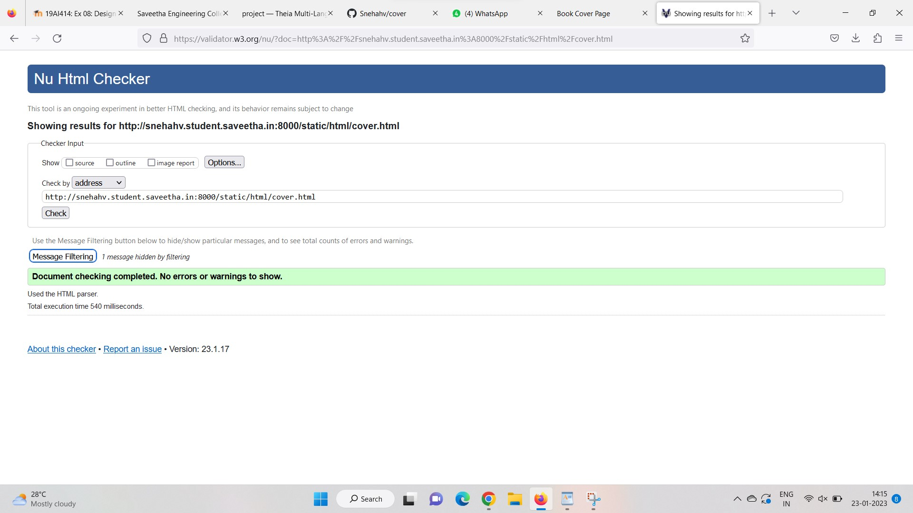

# cover-page-design
## AIM:
To develop a website to display the cover page design of a book

## Design Steps:

### Step 1:
clone the github rep0sitory and creat django admin interface
### Step 2:
write html and css code for design
## Code:

```
<!DOCTYPE html>
<html lang="en">
    <head>
        <meta name="viewport"
        content="width=decice-width,initial-scale=1.0">
        <style>
            .bookpage{
                width: 400px;
                height: 600px;
                color: darkblue;
                margin-left: auto;
                margin-right: auto;
                padding: 20px;
                font-family: 'Franklin Gothic Medium', 'Arial Narrow', Arial, sans-serif;
                background-image: url(/static/images/back.jpg);
                background-size: cover;
            }
            
            .insight{
                color: black;

            }

            .hrstyle{
                width: 100px;
            }

            .author{
                display: inline;
                position: relative;
                color: darkblue;
                top: 190px;

                font-family: Georgia;
                font-size: medium;

            }

            .booktitle{
                font-family: 'Courier New', Courier, monospace;
                font-size: larger;
                text-align: center;
                position: relative;
                top: 30px;

            }

            .id{
                width: 400px;
                position: relative;
                top: 180px;

            }
            .pub{
                font-size: medium;
                position: relative;
                top: 155px;
                left: 330;

            }

            .ed{
                color: darkred;
                font-size: medium;
                font-family: Verdana;
                position: relative;
                top: 85px;
            }

            .subtitle{
                font-family: Tahoma;
                font-size: large;
                position: relative;
                top: 40px;
            }

            .mypic{
                position: relative;
                top: 135px;
                left: 260px;
                width: 100px;
                height: 100px;
                background-size: cover;
            }

            </style>
            <title>Book Cover Page</title>
    </head>
    <body>
        <div class="bookpage">
            <div class="insight">
                SEC INSIGHT
            </div>
            <div class="hrstyle">
                <hr style="color: darkblue;">
            </div>
            <div class="booktitle">
                <h1>FUNDAMENTALS OF WEB APPLICATION DEVELOPMENT</h1></div>
                <div class="subtitle">HTML & CSS Combined with Django Architecture</div>
                <div class="mypic">
                    
                </div>
                <div class="id">
                    <hr style="color: maroon;">
                <div>
                    <div class="author">
                        <p><b>Sneha</b></p>
                    
                    </div>
                    <div class="pub">
                        SEC
                    </div>
                    <div class="ed">
                        <b>First Edition</b>
                    </div>
              </div>
         </body>
   </html>
   ```


## Output:


## HTML VALIDATOR


## Result:
the program for design book cover page using HTML and CSS is succesfully
